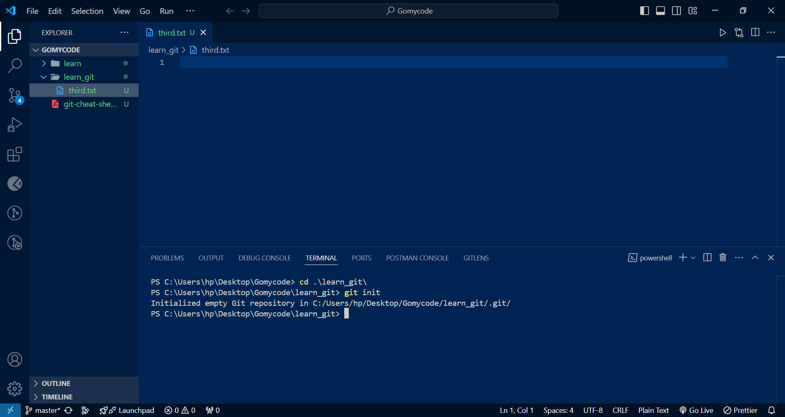
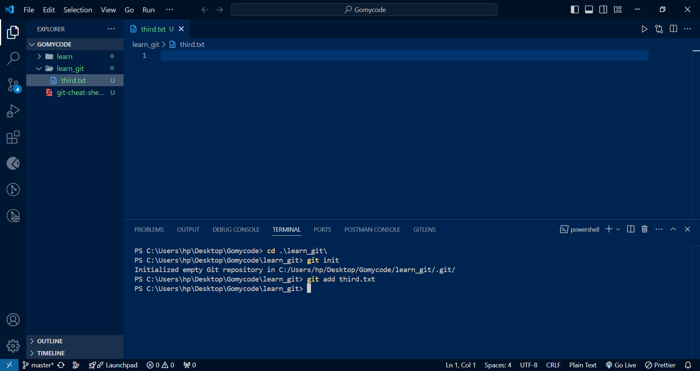
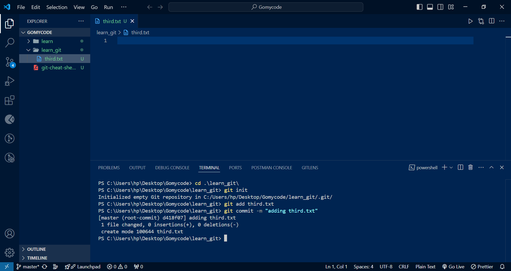
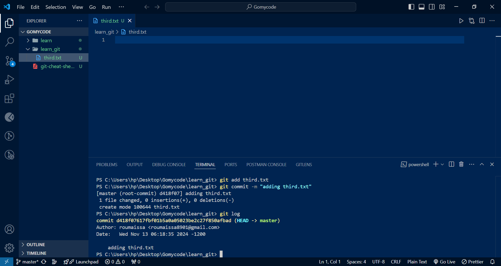
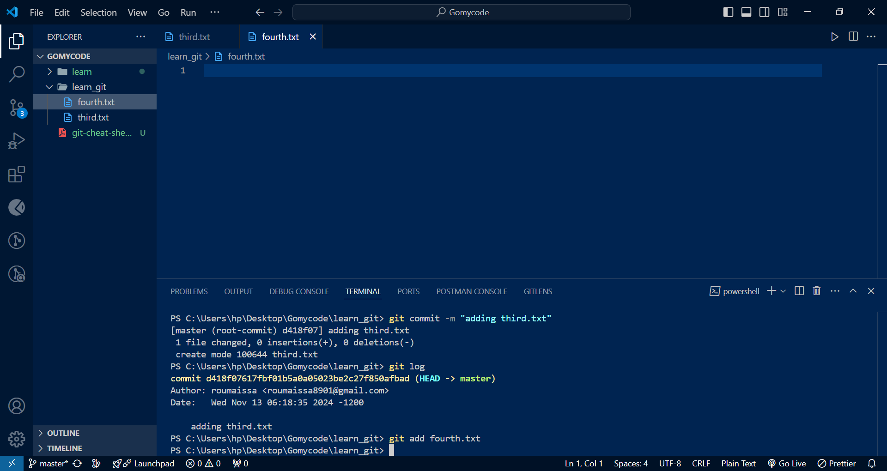
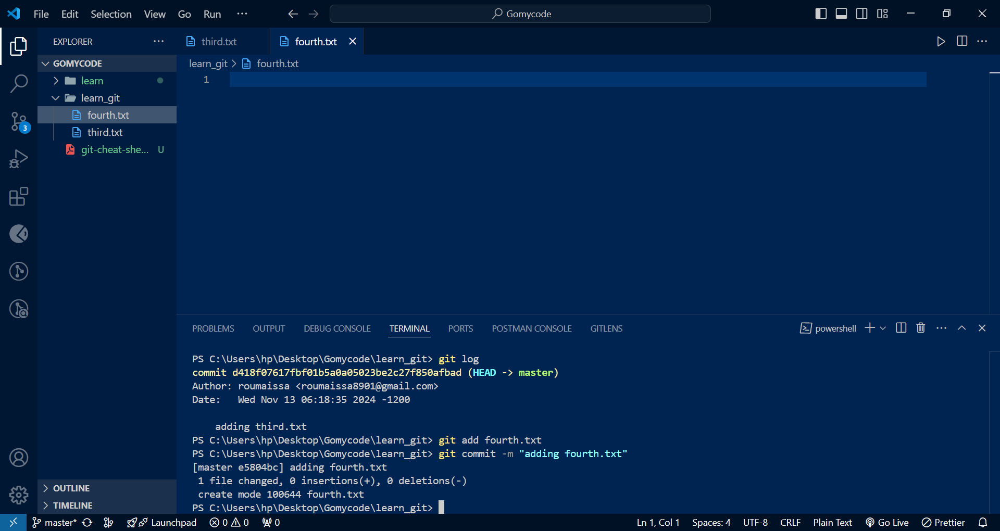
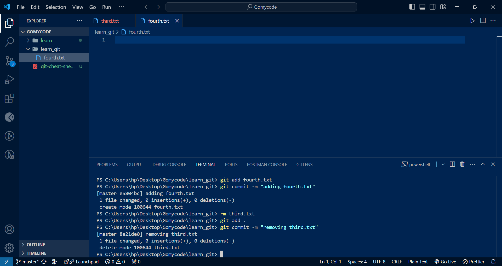
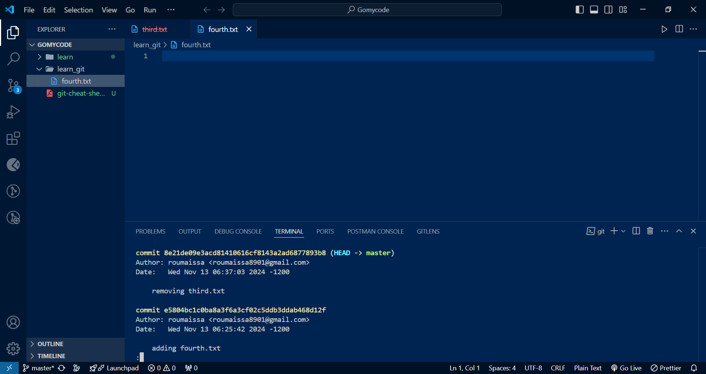
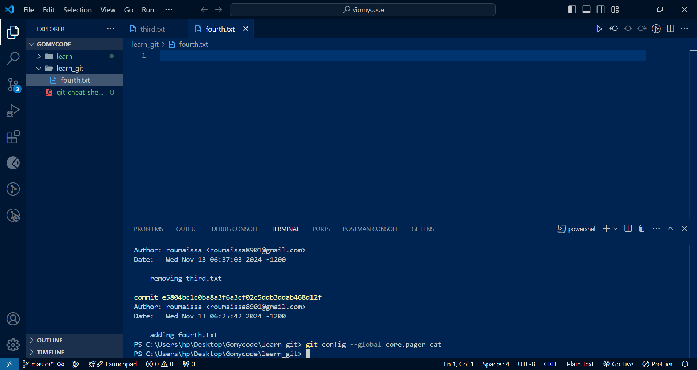
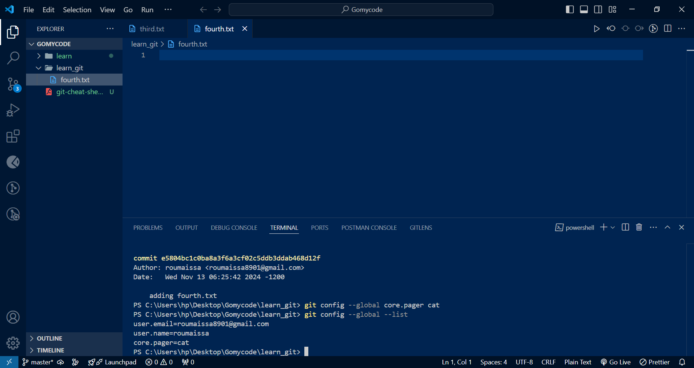

# Git task questions answers

> i try to expline my answers with a simple caption after each photo

## 1. Initialize an empty git repository :


command used :

```
git init
```

## 2. Add third.txt to the staging area :


command used :

```
git add third.txt
```

## 3. Commit with the message "adding third.txt" :


command used :

```
git commit -m "adding third.txt"
```

## 4. Check out my commit :


command used :

```
git log
```

## 5. Add fourth.txt to the staging area :



```
git add third.txt
```

## 6. Commit with the message "adding fourth.txt" :


command used :

```
git commit -m "adding fourth.txt"
```

## 7. Remove the third.txt file and Add this change to the staging area and commit :


command used :

```
rm third.txt
git add .
git commit -m "removing third.txt"
```

## 8. Check out my commits :


command used :

```
git log
```

## 9. Change my global settings to core.pager=cat :


command used :

```
git config --global core.pager cat
```

this change to cat pager, which will display the output all at once without a pager

## 10. list all the global configurations for git :


command used :

```
git config --global --list
```
